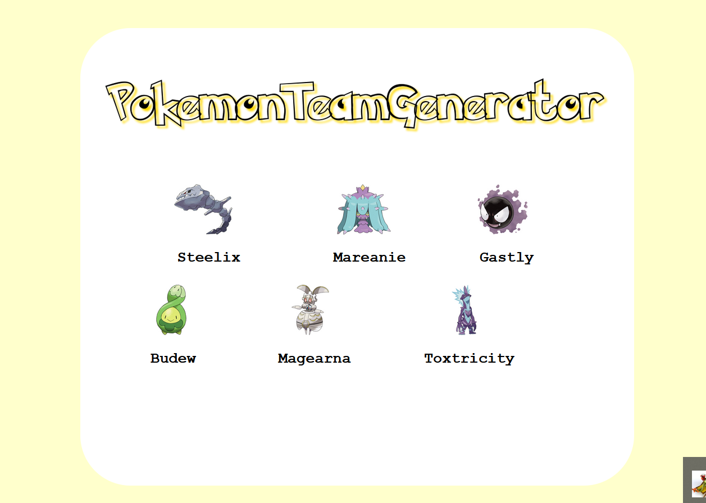

# Pokemon Team Generator

PTG it's a porject to focus on improve Python, http, css and another skills.
Its based on web scraping so if you want to execute the project (Main.py), you will have to wait 2 minutes aprox for the webs 
and data managament.
The web scraping is based on selenium and use Firefox to execute it.

When the code executes will ask you for the type of pokemon that you want to Figth and then will pop up a web-page 
with the team like that:

The scripts dont consider the double type so if the pokemon has  a type good against the team it is OK for the program.
